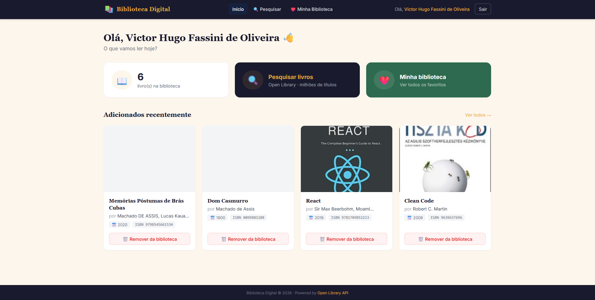
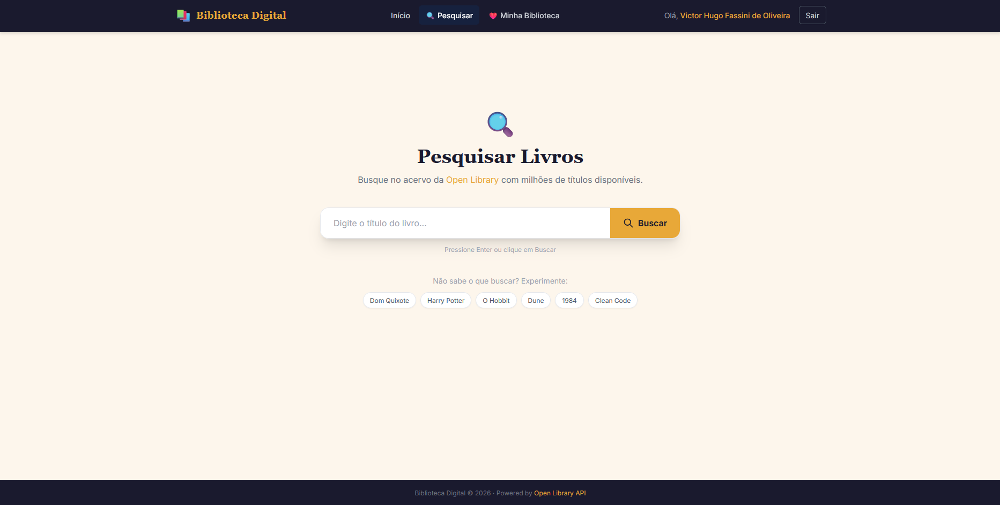
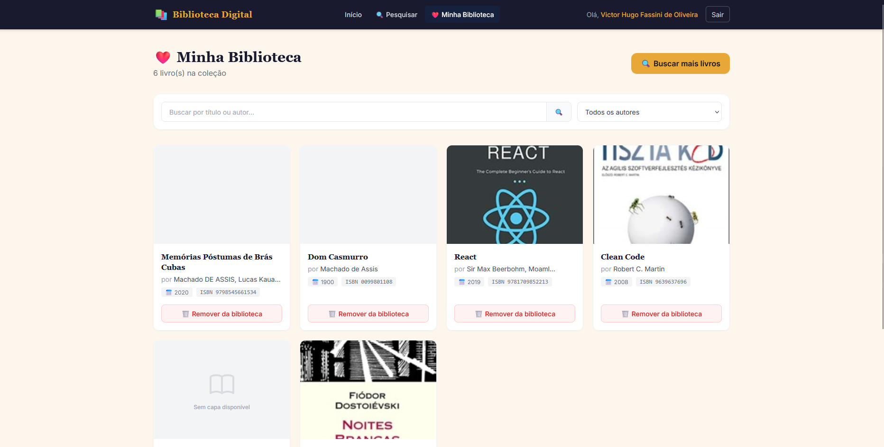
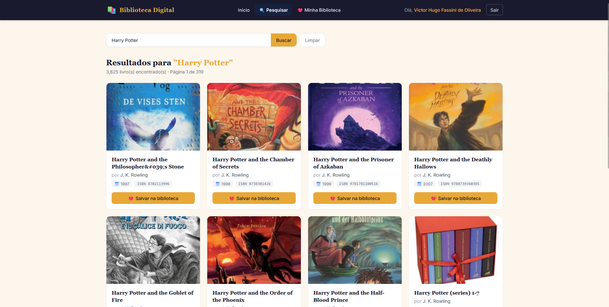

# 📚 Projeto Biblioteca Digital

Sistema web em Laravel 12 para pesquisa e organização de livros favoritos,
integrado com a Open Library API.

---
## 📸 Capturas de Tela

🏠 Início


🔍 Pesquisar


📚 Minha Biblioteca


📖 Resultado da Pesquisa


---

## 🧰 Requisitos

| Ferramenta | Versão |
|-----------|--------|
| PHP | 8.4+ |
| Composer | 2.x |
| Node.js | 20+ |
| MySQL | 8.0+ |
| Laravel | 12.x |

---

## 🚀 Instalação

```bash
# 1. Clone o repositório
git clone https://github.com/Vickthor1/Projeto_Biblioteca_Digital Projeto_Biblioteca_Digital
cd Projeto_Biblioteca_Digital

# 2. Instale as dependências PHP
composer install

# 3. Instale as dependências Node
npm install

# 4. Copie e configure o .env
cp .env.example .env
php artisan key:generate

# 5. Configure o banco de dados no .env
DB_CONNECTION=mysql
DB_HOST=127.0.0.1
DB_PORT=3306
DB_DATABASE=biblioteca_digital
DB_USERNAME=root
DB_PASSWORD=sua_senha

# 6. Execute as migrations e seeders
php artisan migrate --seed

# 7. Compile os assets
npm run build

# 8. Inicie o servidor
php artisan serve
```

Acesse: http://localhost:8000

---

## 👤 Usuário de demonstração (após seeder)

| Campo | Valor |
|-------|-------|
| E-mail | demo@biblioteca.com |
| Senha | password |

---

## 🗂️ Estrutura de Diretórios

```
app/
├── Http/
│   ├── Controllers/
│   │   ├── BookController.php          # Pesquisa de livros via API
│   │   └── FavoriteBookController.php  # CRUD da biblioteca pessoal
│   └── Requests/
│       └── StoreFavoriteBookRequest.php # Validação ao salvar favorito
├── Models/
│   ├── User.php                        # Model do usuário
│   └── FavoriteBook.php                # Model dos favoritos
├── Policies/
│   └── FavoriteBookPolicy.php          # Autorização por usuário
└── Services/
    └── OpenLibraryService.php          # Integração com a API

database/
├── migrations/
│   └── ..._create_favorite_books_table.php
└── seeders/
    ├── DatabaseSeeder.php
    └── DemoUserSeeder.php

resources/views/
├── layouts/
│   └── app.blade.php                   # Layout principal
├── components/
│   ├── book-card.blade.php             # Card reutilizável de livro
│   └── alert.blade.php                 # Alertas de feedback
├── books/
│   ├── search.blade.php                # Tela de pesquisa
│   └── results.blade.php              # Resultados da busca
├── favorites/
│   └── index.blade.php                 # Biblioteca pessoal
└── dashboard.blade.php                 # Dashboard do usuário
```

---

## 🔐 Rotas

| Método | Rota | Descrição |
|--------|------|-----------|
| GET | / | Página inicial |
| GET | /login | Tela de login |
| GET | /register | Tela de registro |
| GET | /dashboard | Dashboard (auth) |
| GET | /books/search | Tela de busca (auth) |
| GET | /books/results | Resultados da busca (auth) |
| POST | /favorites | Salvar favorito (auth) |
| GET | /favorites | Biblioteca pessoal (auth) |
| DELETE | /favorites/{id} | Remover favorito (auth) |

---

## 🧪 Testes

```bash
php artisan test
```

---

## ⚡ Cache da API

As respostas da Open Library API são cacheadas por 1 hora via `Cache::remember`.
Para limpar: `php artisan cache:clear`
